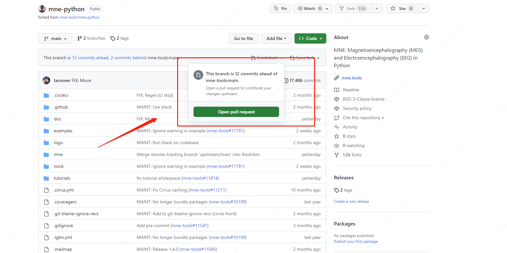
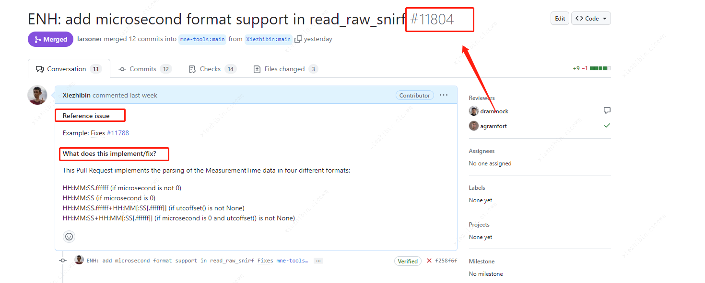
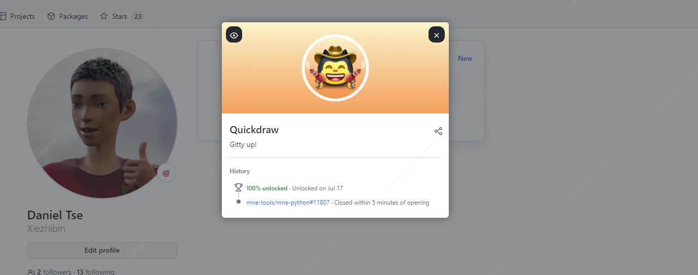

# 开源代码提交

贡献并且参与开源项目是很多人的理想，记录一下我的开源的申请的任务提交流程

## Fork 需要开源的代码 repository

在建立自己本地的codebase之前，需要进入想要修改的github page 页面，并且fork改项目到自己账号的私有空间之中。


在本地建立起fork("origin")和local codebase, 任何修改push到fork代码，并通过合并的方式（incorporated）将修改提交到 official version 的分支之中(often called the “upstream version”) 通过 “pull request”。 Github账号的Fork、本地local版本、official version 中三者的关系可以在下面图中被发现。


## 通过git提交代码

git 是一个强大的和复杂的工具，版本管理的效果的确非常出色，git基本命令可以参考前面的[git命令大全章节](./git.md)。

git 在国内需要魔法可以参考[Codespace白嫖手册](./codespaces.md) + vscode 通过远程服务器来进行提交和变更

下面说一下PR上传中的实践：

- 克隆

```shell
# 克隆本地开发环境中repository分支)
git clone <URL_OF_REMOTE_REPO> 

# 添加本地开发环境和远程的关系
git remote add <NICKNAME_OF_REMOTE> <URL_OF_REMOTE_REPO>

# 使用查看 upstream 和 origin 信息
git remote -v 

# 关联official version地址 
git remote add upstream XXX

# 更新
git fetch --all
```

- 同步(使用非main分支进行同步条)

```shell
git checkout main            # switch to local main branch
git fetch upstream             # get the current state of the remote upstream repo
git merge upstream/main      # synchronize local main branch with remote upstream main branch
git checkout -b new-feature-x  # create local branch "new-feature-x" and check it out
```

克隆到新的分支（branch）后，就可在新的branch上修改代码了，一般流程为修改add a feature、add a test、update the documentation。完成这些之后，可以进行[提交](https://git-scm.com/docs/git-commit)


将这些修改按照共同目标组合在一起（以便同事更容易理解和审查这些更改）。对代码库进行一些更改后，获得 git 的 [stage](https://git-scm.com/book/en/v2/Git-Tools-Interactive-Staging)，它将通过 status 命令显示：

```shell
git status    # see what state the local copy of the codebase is in
```
未暂存的变更可以通过(add)[https://git-scm.com/docs/git-add]命令处理

```shell
git add mne/some_file.py      # add all the changes you made to this file
git add mne/some_new_file.py  # add a completely new file in its entirety
# enter interactive staging mode, to add only portions of a file:
git add -p mne/viz/some_other_file.py
```
最后提交本地做完修改变更

```shell
git commit -m 'XXX'
```

一切就绪之后，通过 git push 命令提交

```shell
# push local changes to remote branch origin/new-feature-x
# (this will create the remote branch if it doesn't already exist)
git push origin new-feature-x```

## 提交PR
回到github的仓库主页，点击PULL REQUEST 选项


选择 new pull request, 并且按照项目的文档要求写好提交的变更内容


一切顺利，merge到主分支之后，就会收到github的勋章了



## 结语

希望这份教程能对大家有帮助！

如果还想深入了解如何使用RP，可以查看(GitHub Creating a pull reques 官方文档）[https://docs.github.com/en/pull-requests/collaborating-with-pull-requests/proposing-changes-to-your-work-with-pull-requests/creating-a-pull-request]


