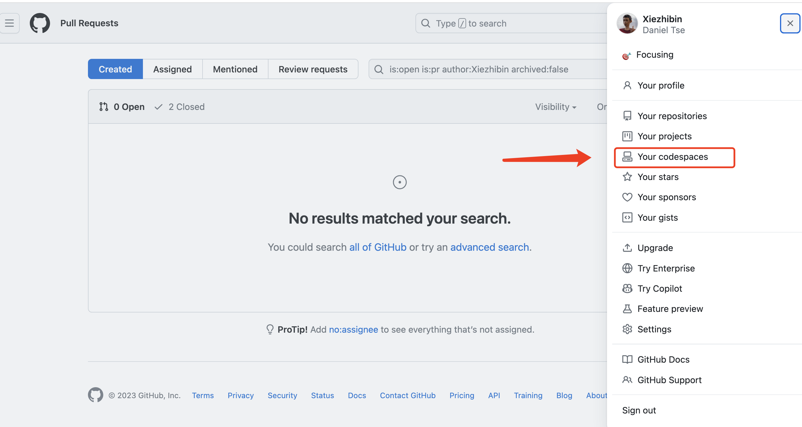
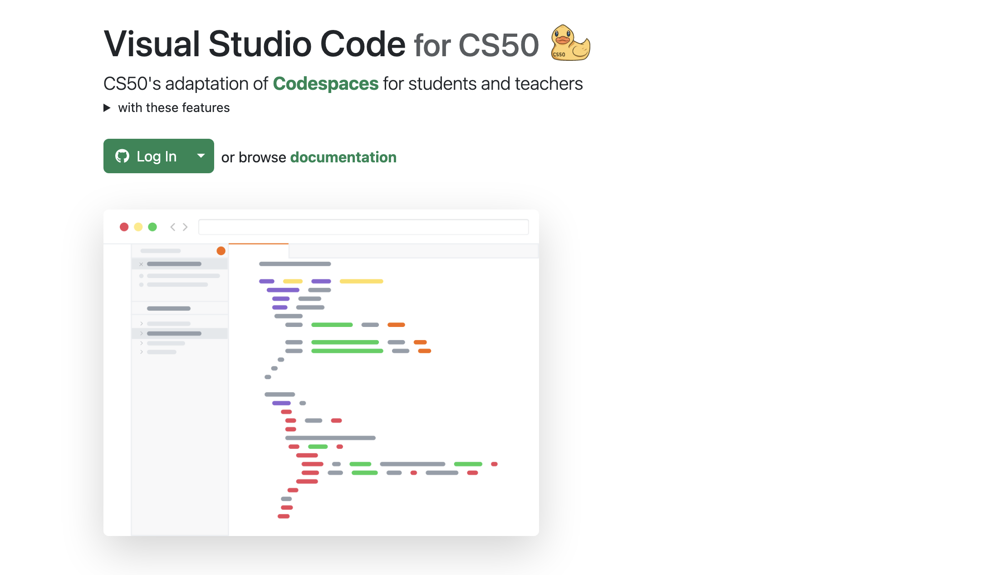

# Codespace白嫖手册

**Codespace**是一个基于云的即时开发工具，类似于GitHub.dev。它为开发者提供了一个便捷的虚拟机环境，可用于共享和开发基本项目。

## 什么是Codespace？

**Codespace是GitHub推出的一项服务，旨在让开发者能够在浏览器中或使用常见的集成开发环境（如Visual Studio Code）中进行代码编辑和开发。通过Codespace，您可以快速创建预配置的开发环境，并直接在浏览器中访问，而无需在本地配置开发环境。**

## 创建方式

**您可以通过以下方式创建Codespace：**

* [为存储库创建Codespace](https://docs.github.com/zh/codespaces/developing-in-codespaces/creating-a-codespace-for-a-repository)：为特定GitHub存储库创建一个Codespace环境。
* [通过模板创建Codespace](https://docs.github.com/zh/codespaces/developing-in-codespaces/creating-a-codespace-from-a-template)：使用现有模板创建一个Codespace环境。
* [打开现有Codespace](https://docs.github.com/zh/codespaces/developing-in-codespaces/opening-an-existing-codespace)：打开您之前创建过的Codespace环境。

**您可以在GitHub网页上查看已创建的Codespace，路径为：右上角头像 -> "Your Codespaces"。**

## 连接到Codespace

**创建容器并完成其他初始化后，您将可以连接到Codespace，并在其中进行代码编辑和开发。您可以通过以下方式连接到Codespace：**

* **Web浏览器**：直接在浏览器中访问Codespace，无需安装任何软件。
* [Visual Studio Code](https://docs.github.com/zh/codespaces/developing-in-codespaces/using-github-codespaces-in-visual-studio-code)：使用VS Code的GitHub Codespaces扩展连接到Codespace。
* [JetBrains IDE](https://docs.github.com/zh/codespaces/developing-in-codespaces/using-github-codespaces-in-your-jetbrains-ide)：在JetBrains IDE中连接到Codespace。
* [GitHub CLI](https://docs.github.com/zh/codespaces/developing-in-codespaces/using-github-codespaces-with-github-cli)：使用GitHub命令行界面连接到Codespace。

## 计费规则

*目前，GitHub Codespace服务仅对组织和企业收费，对***个人用户免费**。这意味着个人开发者可以免费使用Codespace来提高开发效率。

**具体的收费政策和价格信息，请查看**

## 白嫖企业版本

**GitHub对一些开源和教育项目是完全免费的，因此您可以通过这些项目白嫖企业版本的Codespace。具体步骤如下：**

1. **使用您的GitHub账号登录**[cs50.dev](https://cs50.dev/)。
2. **一旦建立起与GitHub的连接，您就可以免费使用虚拟机进行学习和工作。**

## 结语

希望这份教程能对大家有帮助！

如果还想深入了解如何使用codespace，可以查看[GitHub Codespaces官方文档](https://docs.github.com/zh/codespaces/getting-started/quickstart#introduction)
