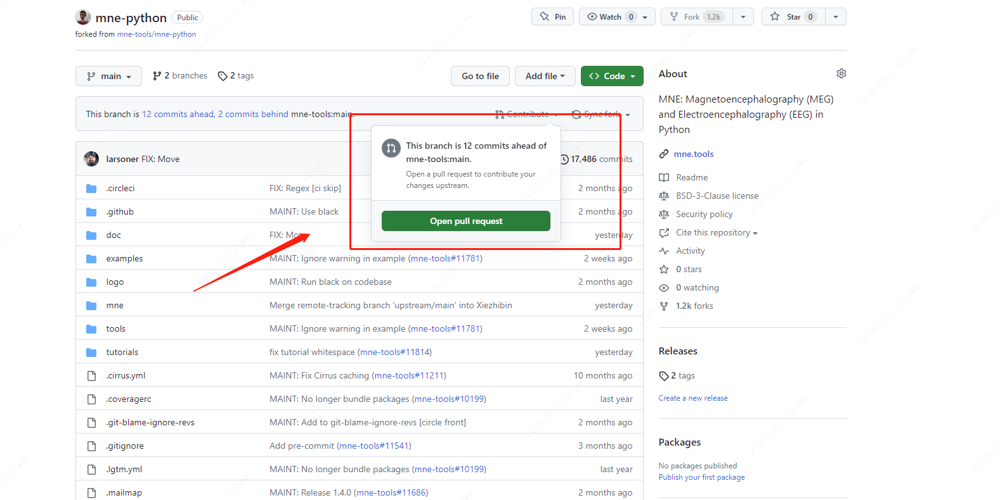

# 开源代码提交指南

贡献并参与开源项目是很多人的理想，下面是记录了开源项目申请任务提交流程的指南。

## Fork 需要开源的代码 repository

在开始修改代码之前，首先需要进入想要修改的 GitHub 仓库页面，并将该项目 fork 到你自己的 GitHub 账号下的私有空间中。


然后在本地建立 fork（origin）和本地代码库（local codebase）。任何修改都需要 push 到 fork 代码中，并通过合并（incorporated）的方式将修改提交到官方版本的分支中（通常称为 "upstream version"），这需要通过 "pull request" 完成。下图展示了 GitHub 账号的 fork、本地代码库、官方版本之间的关系：


## 通过 git 提交代码

Git 是一个强大且复杂的版本管理工具。你可以参考之前的[Git 命令大全章节](./git.md)学习 Git 的基本命令。

在国内，如果 Git 需要魔法可以参考 [Codespace 白嫖手册](./codespaces.md) + VS Code，通过远程服务器进行提交和变更。

下面是 PR（Pull Request）上传的具体实践：

### 克隆

```shell
# 克隆本地开发环境中的 repository 分支
git clone <URL_OF_REMOTE_REPO> 

# 添加本地开发环境和远程的关系
git remote add <NICKNAME_OF_REMOTE> <URL_OF_REMOTE_REPO>

# 使用以下命令查看 upstream 和 origin 信息
git remote -v 

# 关联 official version 地址 
git remote add upstream <URL_OF_UPSTREAM_REPO>

# 更新
git fetch --all
```

### 同步（使用非 main 分支进行同步）

```shell
git checkout main            # 切换到本地的 main 分支
git fetch upstream             # 获取远程 upstream 仓库的当前状态
git merge upstream/main      # 将本地 main 分支与远程 upstream main 分支同步
git checkout -b new-feature-x  # 创建本地分支 "new-feature-x" 并切换到该分支
```

克隆到新的分支（branch）后，就可以在该分支上修改代码了。一般的工作流程是：添加一个新特性、添加相应的测试、更新文档。完成这些工作后，可以进行[提交](https://git-scm.com/docs/git-commit)。

将这些修改按照共同的目标组合在一起，以便同事更容易理解和审查这些更改。在对代码库进行一些更改后，运行 `git status` 命令可以查看当前本地代码库的状态。

未暂存的变更可以通过 `git add` 命令处理：

```shell
git add mne/some_file.py      # 将对某个文件的所有更改添加到暂存区
git add mne/some_new_file.py  # 将完全新建的文件添加到暂存区
# 进入交互式暂存模式，可以选择只添加部分文件的更改：
git add -p mne/viz/some_other_file.py
```

最后，提交本地的修改：

```shell
git commit -m 'XXX'
```

一切准备就绪后，通过 `git push` 命令将修改推送到远程仓库：

```shell
# 将本地修改推送到远程分支 origin/new-feature-x
# （如果该远程分支不存在，这个命令会创建它）
git push origin new-feature-x
```

## 提交 PR

回到 GitHub 仓库主页，点击 "Pull Request" 选项：



选择 "New Pull Request"，并按照项目的文档要求填写提交的变更内容：


一切顺利，当你的修改被合并到主分支后，你将会收到 GitHub 的勋章：


## 结语

希望这份教程对大家有所帮助！

如果你还想深入了解如何使用 PR，可以查看 GitHub 的官方文档：[Creating a Pull Request](https://docs.github.com/en/pull-requests/collaborating-with-pull-requests/proposing-changes-to-your-work-with-pull-requests/creating-a-pull-request)。